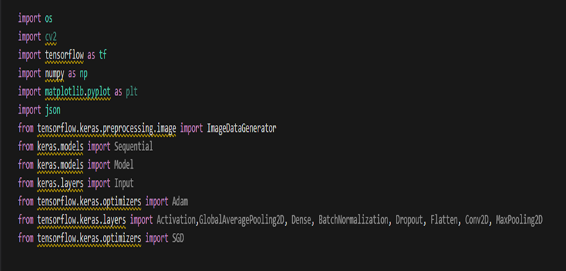
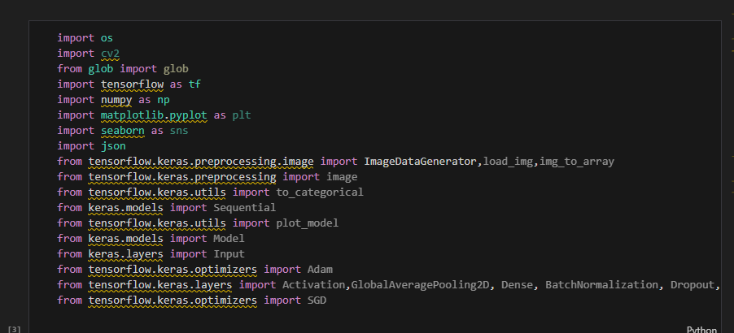
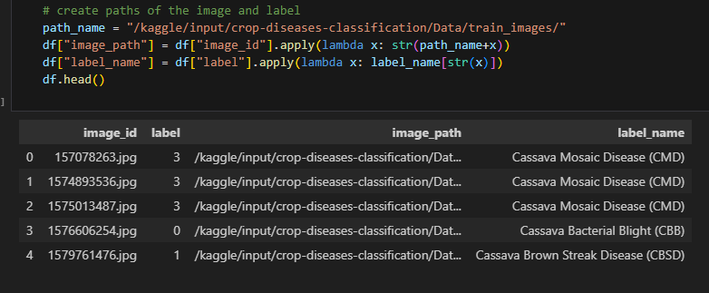
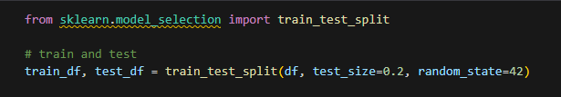
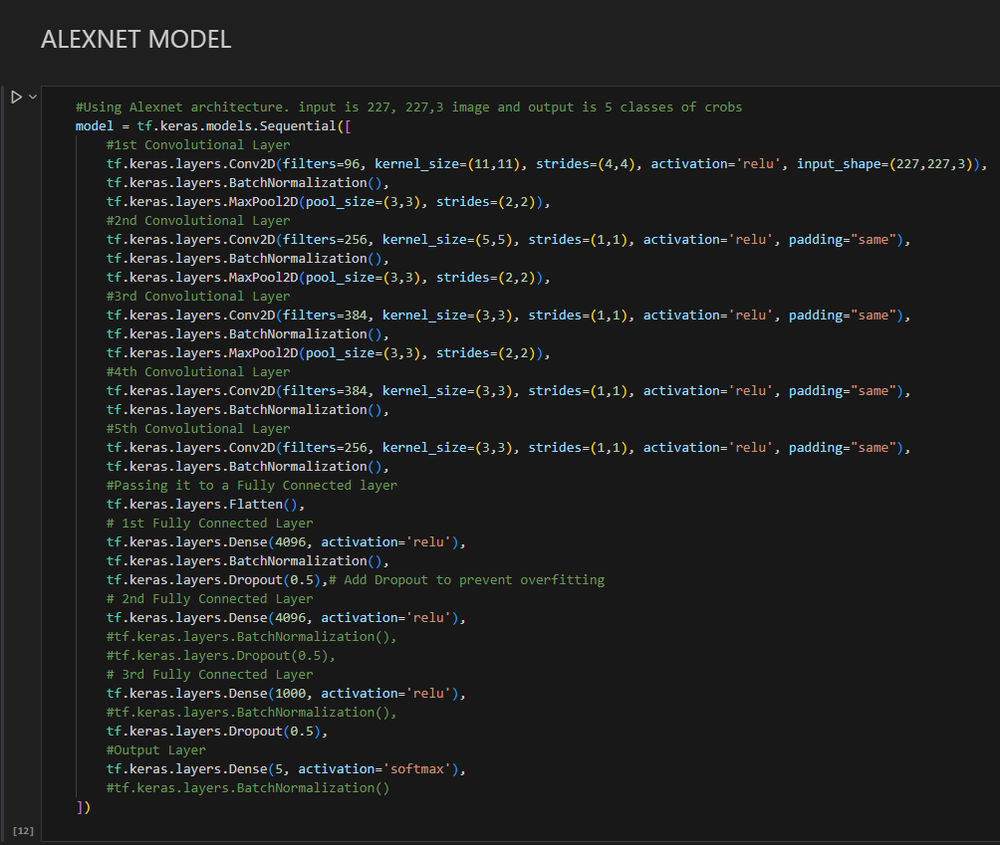
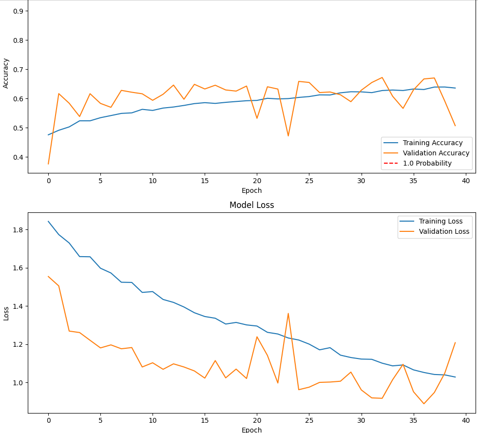

#### Crop-diseases-classification-Different-Models
https://www.kaggle.com/datasets/mexwell/crop-diseases-classification/data

Yukarıda belirtilen linkteki ilgili veri seti üzerinde proje uygulanmıştır.

Proje kapsamında ilgili veri seti ile;
1. Alexnet, VGGnet, Resnet ve Googlenet mimarileriyle modellerinin kurulması
2. Model için öğrenme hızı, kernel boyutu, padding vb. farklı parametre ayarlamaları
3. Doğruluk, Kesinlik, Geri Çağırma, F-ölçüsüne dayalı olarak sonuçları içeren modellerin
performansı için bir karşılaştırma tablosu
4. Geliştirilen mimarinin detaylıca anlatımı
5. En iyi performans elde edilen parametre değerleri sunulmuştur.

Mimari de genel olarak önce veri hazırlanmış, gerekli preprocessing işlemler uygulanmış, sonrasında model
kurulup eğitilmiş ve grafik ile tablolar oluşturulmuştur.
Geliştirilen mimari detaylıca şöyledir:

1. Veri setine ait tüm dosyalar yüklenmiştir ve ardından gerekli kütüphaneler import
edilmiştir.

    
    

“train.csv” dosyası okunup ardından dataframe’e dönüştürülmüştür. Dataframe’e
“label_name” ve “image_path” sütunları eklenmiştir.

    

Dataframe, train ve test olarak bölünmüştür.

    

İlk 3 adım için veri seti ayrıca incelenmiş. Bazı sınıfların yoğunlukta olduğu
gözlemlenmiştir.

4. Sıra modelleri kurmaya geldi. İlk modelimiz “ALEXNET” için katmanları oluşturup model
kurulmuştur.

    a. ALEXNET için input_shape 227x227x3 dür. Conv2D ile MaxPool2D arasında
    “BatchNormalization” kullanılmıştır. Toplam 6 adet kullanılması uygun
    görülmüştür. Ayrıca Dense katmanlarından sonra 2 adet “Dropout” kullanılmıştır.
    Tüm parametreler resimde görüldüğü gibidir.

    

        
    

    

6. Alexnet modeli için model compile yapılmış olup SGD, "Stochastic Gradient Descent"
kullanılmıştır. Learning rate olarak “0.0001” kullanılmıştır. Metrics olarak da accuracy
yapılmıştır.

7. Bu adımda “epochs”, “batch_size”, ”image_height”, “image_widht” parametleri statik
olarak belirlenmiştir. Bu hem modele uygunluk için hem de optimum sonuçları almak için
deneme yanılma yoluyla böyle belirlenmiştir.
    
    a. Ardından veri normalize edilip veri artırma işlemi için “ImageDataGenerator” fonksiyonu kullanılmıştır. Bu fonksiyondaki parametre ayarları yine deneme yanılma yoluyla denenmiş ve buna göre ayarlanmıştır.

Eğitim sırasında epoch sayısı 10,20,40 ve 50 olarak ayarlanmış ve 50 epoch uygun görülmüştür.
Batch_size kısmında 16,32,64 ve 128 denenmiş ve en iyi ve düzenli sonuçları 32 olduğunda
alındığı gözlemlenmiştir. Optimizers kısmında “SGD”, “ADAM” türleri kullanılmış ve “Adam”
türünde çok fazla dengesizlikler olduğu saptanmış ve SGD seçilmiştir. Böylece daha düzenli ve
güzel sonuçlar alınmaya çalışılmıştır. Loss olarak da “crossentropy” kullanılmıştır.

    ALEXNET

    

    

 

11. Bu adımla birlikte aslında işlemler tekrarlanıyor. Adım 4’ ü diğer model için uygula, adım
5 uygula, epoch, batch_size vs ayarla, adım 7-8-9’u uygula sıradaki model için.
******************************************************************************************
<h4>VGGNET:</h4>

12. VGGnet için, “VGGnet16” mimarisi uygulanmaya çalışılmıştır. Sırayla önce model kurulup
sonra compiler edilmiştir. Ardından gerekli ara işlemler uygulanıp eğitilmiştir. Grafik ve
tablo çizilmiştir.

Model kurulmuştur:

13. Compile edilip, summary’sine (Katman katman gösterir) bakılmıştır:

14. Parametreler ayarlanıp, data augmentation generator (veri artırma jeneratörü) kodu
çalıştırılmıştır:

15. Eğitilmeye başlanmıştır. Ve accuracy – loss grafikleri çizilmiştir. Ayrıca diğer metrik
karşılaştırmaları için tablo oluşturulmuştur.

17. Diğer metriklerin de bulunduğu tablo:

Eğitim sırasında epoch sayısı 20,40 ve 50 olarak denenmiştir. 20 epochta, daha fazla
eğitilebileceği görülmüştür, 50 epochta da loss değerinin artığı gözlemlenmiştir. 40 epoch
sonunda iyi bir eğitim süreci geçirdiği gözlemlenmiş ve 40.epochtan sonra val_loss değerinin
artma eğilimine girdiği gözlemlenmiştir. Bu yüzden 40 epoch uygun görülmüştür.

Batch_size kısmında 16,32,64 denenmiş ve en iyi ve düzenli sonuçları 32 olduğunda alındığı
gözlemlenmiştir. Optimizers kısmında “SGD”, “ADAM” türleri kullanılmış ve “Adam” türünde çok
fazla dengesizlikler olduğu saptanmış ve SGD seçilmiştir. Böylece daha düzenli ve güzel sonuçlar
alınmaya çalışılmıştır. Loss olarak da “crossentropy” kullanılmıştır.

RESNET:

Resnet mimarisi için biraz araştırma yaptıktan sonra “Resnet18” mimarisi hem hız hem
optimize kolaylığından kullanılması kararlaştırılmıştır. Önceki modellerde olduğu gibi model önce
kurulmuş ardından compile edilmiştir. Sonra da parametre ve diğer ayarlar yapılıp eğitilmiştir.
Grafik ve tablolar oluşturulmuştur.

17. Model katmanları ve modelin oluşturuldu. Burada residual bloklar önceki modellerden
farklı olarak kullanılmıştır.

18. Ardından resnet model compile edilip loss, optimizer ve metrics belirlenmiştir. Sonra
model özeti çıkarılmıştır.

19. Bu aşamada batch_size, epoch, image_widht, image_height parametreleri belirlenmiştir
resnet modeline uygun olarak. Ayrıca data augmentation generator uygulanmıştır önceki
modellerdeki gibi.

20. Resnet modeli 20 epoch olacak şekilde eğitilmiştir ve accuracy-loss grafikleri çizilmiştir.
Ayrıca f1-score, recall gibi metrikler içinde tablo oluşturulmuştur.

RESNET İÇİN PARAMETRELER:
Epochs = 20 / Batch_size = 32 / input_shape=224*224*3 / optimizers: SGD / learning rate:0.0001
Loss: categorical_crossentropy
Eğitim sırasında epoch sayısı 20,40 olarak denenmiştir. 40 epochta, belirli bir yerden accuracy
değerinin stabil kalmaya başladığı görülmüştür. 20 epoch denendiğinde hem tüm epochlar
boyunca accuracy kısmında artış, hem de loss kısmında azalış görülmüştür. Bu epoch sayısında
daha güzel sonuçlar alındığından bu değer seçilmiştir.
Batch_size kısmında 32,64,128 denenmiş ve en iyi ve düzenli sonuçları 32 olduğunda alındığı
gözlemlenmiştir. Optimizers kısmında “SGD”, “ADAM” türleri kullanılmış ve “Adam” türünde çok
fazla dengesizlikler olduğu saptanmış ve SGD seçilmiştir. Böylece daha düzenli ve güzel sonuçlar
alınmaya çalışılmıştır. Loss olarak da “crossentropy” kullanılmıştır.
“”””””””””””””””””””””””””””””””””””””””””””””””””””””””””””””””””””””””””””””””””””””””””””””
GOOGLENET:
Son modelimiz olan GoogleNET için pretrained model kullanılarak yapılmıştır. İmagenet
adlı veri setinin ağırlıklarını alarak başlayan modelimiz daha sonrasında kendi veri setimiz
üzerinde eğitilmiştir.
> Tensorflow.keras.application ‘dan çağrılan InceptionV3 kullanılarak yapılmıştır.
InceptionV3, googleNET’in 3.versiyonu diyebiliriz. Daha geliştirilmiş halidir.
21. Model kurulmuş ve compile edilmiştir. Ardından özeti gösterilmiştir.

22. Bu aşamada batch_size, epoch, image_widht, image_height parametreleri belirlenmiştir
googlenet modeline uygun olarak. Ayrıca data augmentation generator uygulanmıştır
önceki modellerdeki gibi.

23. Model eğitilmiştir. Accuracy-loss grafikleri ve diğer tüm metrikler için tablo
oluşturulmuştur.

GOOGLENET İÇİN PARAMETRELER:
Epochs = 40 / Batch_size = 32 / input_shape=224*224*3 / optimizers: SGD / learning rate:0.0001,
Loss: categorical_crossentropy
Parametreler yukarıdaki gibidir. Optimizer olarak SGD (scholastic gradient descent) kullanılmıştır.
Epochlar denenmiş, 40 epoch , batch_size olarak 32 uygun görülmüştür.
MODELLER BİTTİ. TÜM MODELLERİ KARŞILAŞTIRMAK İÇİN TABLO OLUŞTURULMUŞTUR.

<table>
    <caption>Model Accuracy and Parameters</caption>
    <thead>
        <tr>
            <th>Model</th>
            <th>Accuracy</th>
            <th>Epoch</th>
            <th>Batch Size</th>
            <th>Image Size</th>
            <th>Optimizer & Learning Rate</th>
        </tr>
    </thead>
    <tbody>
        <tr>
            <td>ALEXNET</td>
            <td>0.6513</td>
            <td>50</td>
            <td>32</td>
            <td>227x227x3</td>
            <td>SGD 0.0001</td>
        </tr>
        <tr>
            <td>VGGNET</td>
            <td>0.6341</td>
            <td>40</td>
            <td>32</td>
            <td>224x224x3</td>
            <td>SGD 0.0001</td>
        </tr>
        <tr>
            <td>RESNET</td>
            <td>0.8125</td>
            <td>20</td>
            <td>32</td>
            <td>224x224x3</td>
            <td>SGD 0.0001</td>
        </tr>
        <tr>
            <td>GOOGLENET</td>
            <td>0.6729</td>
            <td>40</td>
            <td>32</td>
            <td>224x224x3</td>
            <td>SGD 0.0001</td>
        </tr>
    </tbody>
</table>

<table>
    <caption>Model Data Normalization, Augmentation, and Pretraining</caption>
    <thead>
        <tr>
            <th>Model</th>
            <th>Normalize </th>
            <th>Data Augmentation</th>
            <th>Data Generator</th>
            <th>Pretrained</th>
        </tr>
    </thead>
    <tbody>
        <tr>
            <td>ALEXNET</td>
            <td>☑</td>
            <td>☑</td>
            <td>☑</td>
            <td>⮽</td>
        </tr>
        <tr>
            <td>VGGNET</td>
            <td>☑</td>
            <td>☑</td>
            <td>☑</td>
            <td>⮽</td>
        </tr>
        <tr>
            <td>RESNET</td>
            <td>☑</td>
            <td>☑</td>
            <td>☑</td>
            <td>⮽</td>
        </tr>
        <tr>
            <td>GOOGLENET</td>
            <td>☑</td>
            <td>☑</td>
            <td>☑</td>
            <td>☑</td>
        </tr>
    </tbody>
</table>

Tüm modeller karşılaştırılmıştır. Buradan şu sonuçları çıkarabiliriz:
➔ Alexnet 0.6513 accuracy değerine sahiptir. Katman yapısı, epoch ve image_size yönünden
diğer modellerden farklıdır. VggNET ve Resnet’e göre daha düzenli gitmiştir. GoogleNET’e
göre daha dalgalıdır. Bunların nedeni de katman yapısı ve image_size olabilir. Ayrıca
GoogleNET’te pretrained model kullanılması o modeli daha düzenli hale getirmiştir.
➔ VggNET 0.63 accuracy değeri almıştır. Alexnet’e benzer skor almıştır. Birkaç puan düşük
olmasının nedeni katman yapısı, image_size veya epoch sayısı olabilir. Ancak genel olarak
Alexnet’e benzer şekilde ilerleme kaydetmiştir.

➔ Resnet 0.8125 accuracy değerini almıştır. Diğerlerine farkla oldukça yüksek skor
alınmıştır. Bunun nedeni residual bloklar kullanılması olabilir. Ayrıca 40 epoch olarak da
denenmiş ama daha düşük skor elde edilmiştir. Bu yüzden eğitim sırasında gelen verilerin
de düzeni bu skoru etkilemiş olabilir.
➔ GoogleNET 0.6729 accuracy değeri almıştır. Ancak diğer modellerden farklı olarak
pretrained model kullanışmıştır. Bu şekilde kullanılması da eğitim sürecini oldukça
düzenli hale getirmiştir. Bu yönünden dolayı diğer modellerden ayrılır. Buradan pretrained
model kullanmanın eğitim sürecine nasıl etkili olduğu gözlemlenmiştir.
Kısaca bu proje kapsamında reverse engineering olmuştur. Alınan hatalara karşı çözümler üretilip,
deneme yanılma yöntemiyle parametre ayarlamalarıyla da parametrelerin model üzerindeki
etkileri görülmüştür.

8. Veri artırma jeneratörleri (data augmentation generator), her bir epoch (iterasyon)
sırasında görüntülerin farklı varyasyonlarını sağlayarak eğitim veri setini sürekli olarak
çeşitlendirir ve modelin daha genelleştirilebilir olmasını sağlar. Bu şekilde, overfitting
(aşırı uyum) riski azaltılır ve daha iyi bir model performansı elde edilir. Bu yüzden
mimaride de kullanılması uygun görülmüştür.

9. Alexnet modeli eğitilmiştir ve accuracy değeri 0.6513 olarak bitmiştir.

10. Alexnet modelinin çıktıları “accuracy-val_accuracy” ve “loss-val_loss” grafikleri
çizilmiştir.
